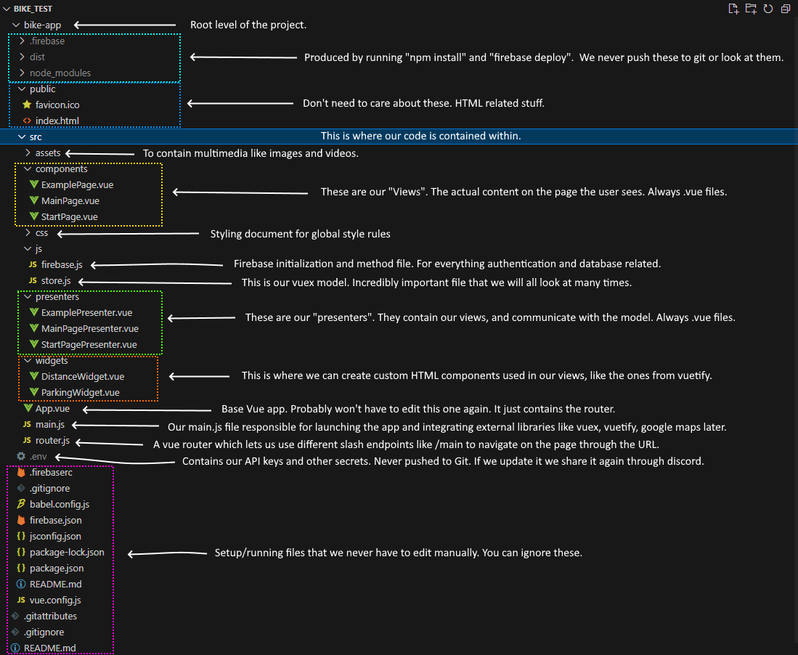

# Web application developer guide for Group 13

## How to get started
1. Install Node JS if you do not have it (I think this is the correct link but double check: https://nodejs.org/en/download)
2. Clone this repository to your computer locally.
3. When you open this repo in Visual Studio Code, you will need to navigate down one level in the folder hierarchy.
   Do this by writing 'cd bike-app' in the terminal inside VSCode. You should now be in GitHub/bike_test/bike-app/
4. Fetch the .env file from our common discord and add it to the root level of the project. There is an image in
   discord for help. 
5. Type in your terminal: "npm install". This will download and install ALL of the dependencies currently in the
   project. The installer finds these in the "package.json" file if you are curious.
6. Type "npm run serve" to start your localhost of the webpage. Your terminal will give you a link to the localhost
   as well, and you can have it on your second screen as you program. Whenever you save a file, it will reflect the
   change instantly in the localhost window without having to relaunch "npm run serve". If you for some reason want
   to cancel the localhost, just press CNTRL + C twice in the terminal to cancel it.

## Our stack
### Vue
We use Vue for our components and presenters, which means that the file type for these is "name.vue". All vue files
have a mandatory `<template> </template>` section in which the HTML code for that Vue component is declared. They also have
a mdandatory `` section where all the component information, custom methods and variables are declared and fetched.

### Vuetify
We use vuetify components (https://vuetifyjs.com/en/components/all/#containment) to make development easier. These are copy-paste
HTML widgets that are already made beautiful and functional for us. In order to use one of these in our ".vue" files, we have to
wrap the content inside of the `<template></template>` in a `<v-app></v-app>` statement.

### VUEX store
This is how we integrate our reactive model. Vuex creates what is called a "store", but to us this simply means a model.
The thing to know about a vuex store is that it contains four things: state, getters, actions, mutations.

1. The state is the ACTUAL contents of the model. Names, lists, variables, any data we can think of.
2. The getters are the declaration of which variables in the state are accessible from the DOM.
3. The actions are REQUESTS to alter the state of the model. This is a middle-man step to actually altering it.
4. The mutations are the changes themselves, written by us. Written in the style of "state.someValue = 5".

Vuex has some peculiar and very specific syntax for how to use these four parts, but you can always follow the example of previous
entries in the model if you have any doubts, or just ask! The important thing to remember is just that we can't alter the model
freely or directly, it always has to go through the steps action -> mutation -> change in state. You can not just use a getter
and then alter that getter.

### Router
We use a Vue router to make redirection and URL changes on the website easier. I'm not very confident with this but I'm following
the example from a previous course so we'll see how it goes!

## Model, view, presenter
We use the programming pattern of model view presenter for this project, which means that the model can never be altered directly by
a view (the part directly visible to the user). Instead, those views communicate requests to a presenter (sort of like a controller)
which in turn requests changes in the model. Likewise, if a view wants to show content from the model it does so through a presenter
which acts like a middleman for requesting and relaying that information as it changes dynamically.

For help with this, in the project I have created two dummy files for reference and/or copy-paste usage whenever we make new views or presenters:

@/components/ExamplePage.vue - an example with extensive comments on how to make a view in the Vue framework.
@/presenters/ExamplePresenter.vue - an example with extensive comments on how to make a presenter for that view w/ Vuex.

If you have any other questions, don't hesitate to ask since not all of us have taken the interaction programming course, and most
people worked with react instead of Vue. Just send Seb a DM whenever and I'll do my best to explain things as well as I can.

## File Structure Image with Explanations

